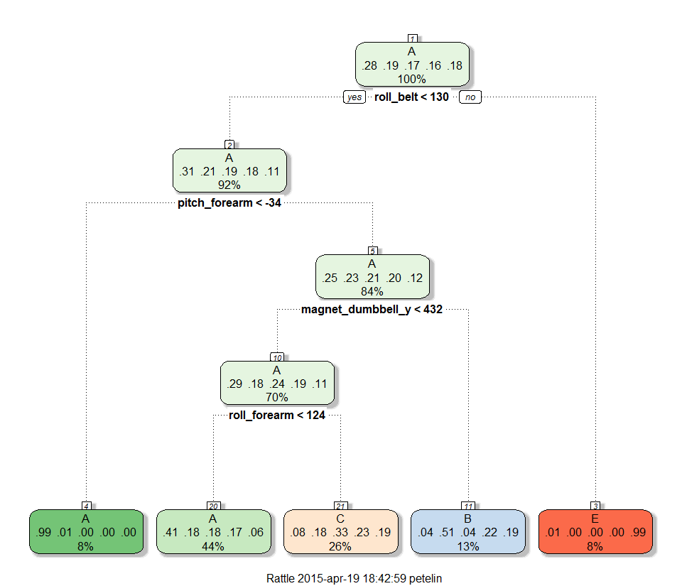

# Practical Machine Learning Course Project

### Background

Using devices such as Jawbone Up, Nike FuelBand, and Fitbit it is now possible to collect a large amount of data about personal activity relatively inexpensively. These type of devices are part of the quantified self movement – a group of enthusiasts who take measurements about themselves regularly to improve their health, to find patterns in their behavior, or because they are tech geeks. One thing that people regularly do is quantify how much of a particular activity they do, but they rarely quantify how well they do it. In this project, your goal will be to use data from accelerometers on the belt, forearm, arm, and dumbell of 6 participants. They were asked to perform barbell lifts correctly and incorrectly in 5 different ways. More information is available from the website here: http://groupware.les.inf.puc-rio.br/har (see the section on the Weight Lifting Exercise Dataset).

### Data 

The training data for this project are available here: 

https://d396qusza40orc.cloudfront.net/predmachlearn/pml-training.csv

The test data are available here: 

https://d396qusza40orc.cloudfront.net/predmachlearn/pml-testing.csv

The data for this project come from this source: http://groupware.les.inf.puc-rio.br/har.

Reference:

Velloso, E.; Bulling, A.; Gellersen, H.; Ugulino, W.; Fuks, H. Qualitative Activity Recognition of Weight Lifting Exercises. Proceedings of 4th International Conference in Cooperation with SIGCHI (Augmented Human '13) . Stuttgart, Germany: ACM SIGCHI, 2013.
http://groupware.les.inf.puc-rio.br/public/papers/2013.Velloso.QAR-WLE.pdf

### Goal of the project

The goal of the project is to predict the manner in which they did the exercise. This is the "classe" variable in the training set. We may use any of the other variables to predict with. We should create a report describing how we built our model, how we used cross validation, what we think the expected out of sample error is, and why we made the choices we did. We will also use our prediction model to predict 20 different test cases.

### Initializing libraries and options


```r
library(knitr)
knitr::opts_chunk$set(cache=TRUE)
knitr::opts_chunk$set(warning=FALSE)
knitr::opts_chunk$set(message=FALSE)
library(caret)
library(rattle)
library(party)
library(gbm)
```

### Getting and cleaning the data

We downloaded the training and testing data from the above websites only to the main memory. Due to problems caused by access to "https" websites, we use the solution from http://stackoverflow.com/questions/28997402/r-read-csv-from-url-error-in-knitr. At the same time we ensure that the data which we read will not be factors. 


```r
library(RCurl)
data <- getURL("https://d396qusza40orc.cloudfront.net/predmachlearn/pml-training.csv",ssl.verifypeer=0L, followlocation=1L)
training <- read.csv(text=data, stringsAsFactors=FALSE)
data <- getURL("https://d396qusza40orc.cloudfront.net/predmachlearn/pml-testing.csv",ssl.verifypeer=0L, followlocation=1L)
testing <- read.csv(text=data, stringsAsFactors=FALSE)
dateDownloaded <- date()
dateDownloaded
```

```
## [1] "Sun Apr 19 18:41:40 2015"
```

First we look into the structure of the data:


```r
str(training)
str(testing)
```

We have 19622 observations and 160 variables in the *training* dataset and 20 observations and 160 variables in the *testing* dataset. There are a plenty of *NA's* in both datasets, so we eliminate the variables with too high proportion of *NA's*. We also eliminate first seven variables (X, user_name, raw_timestamp_part_1, raw_timestamp_part_2, cvtd_timestamp, new_window, num_window), which are not useful for the prediction.


```r
training <- training[,-c(1:7)]
missing <- apply(training, 2, function(x) {round(mean(is.na(x)),2)})
table(missing)
```

```
## missing
##    0 0.98 
##   86   67
```

We have 86 variables without missing values and 67 variables with 98% of missing values, so we use only the former:


```r
training <- training[,missing==0]
```

Next we check for the variables with near zero variance and eliminate them:


```r
trainNZV <- nearZeroVar(training, saveMetrics = TRUE)
trainNZV <- trainNZV[trainNZV$nzv == FALSE,]
training <- training[, rownames(trainNZV)]
```

Now we have left with 53 of useful variables, including the variable *classe*, which we predict:


```r
colnames(training)
```

```
##  [1] "roll_belt"            "pitch_belt"           "yaw_belt"            
##  [4] "total_accel_belt"     "gyros_belt_x"         "gyros_belt_y"        
##  [7] "gyros_belt_z"         "accel_belt_x"         "accel_belt_y"        
## [10] "accel_belt_z"         "magnet_belt_x"        "magnet_belt_y"       
## [13] "magnet_belt_z"        "roll_arm"             "pitch_arm"           
## [16] "yaw_arm"              "total_accel_arm"      "gyros_arm_x"         
## [19] "gyros_arm_y"          "gyros_arm_z"          "accel_arm_x"         
## [22] "accel_arm_y"          "accel_arm_z"          "magnet_arm_x"        
## [25] "magnet_arm_y"         "magnet_arm_z"         "roll_dumbbell"       
## [28] "pitch_dumbbell"       "yaw_dumbbell"         "total_accel_dumbbell"
## [31] "gyros_dumbbell_x"     "gyros_dumbbell_y"     "gyros_dumbbell_z"    
## [34] "accel_dumbbell_x"     "accel_dumbbell_y"     "accel_dumbbell_z"    
## [37] "magnet_dumbbell_x"    "magnet_dumbbell_y"    "magnet_dumbbell_z"   
## [40] "roll_forearm"         "pitch_forearm"        "yaw_forearm"         
## [43] "total_accel_forearm"  "gyros_forearm_x"      "gyros_forearm_y"     
## [46] "gyros_forearm_z"      "accel_forearm_x"      "accel_forearm_y"     
## [49] "accel_forearm_z"      "magnet_forearm_x"     "magnet_forearm_y"    
## [52] "magnet_forearm_z"     "classe"
```

We prepare the testing dataset in the same manner, excluding the variable *classe* which is not present in the testing dataset. Finally, we check if they are any *NA's* in the testing dataset.


```r
testing <- testing[, colnames(training)[colnames(training) != "classe"]]
sum(is.na(testing))
```

```
## [1] 0
```

Therefore, the *testing* dataset is free of *NA* values. The variables are of type *integer* or decimal (i.e. *num*). We coerce all the integers to num's and convert the variable *classe* into factors. We do this for both, the training dataset and test dataset.


```r
classes <- as.character(sapply(training, class))
colClasses <- which(classes=="integer")
training[, colClasses] <- sapply(training[, colClasses], as.numeric)
training$classe <- as.factor(training$classe)

classes <- as.character(sapply(testing, class))
colClasses <- which(classes=="integer")
testing[, colClasses] <- sapply(testing[, colClasses], as.numeric)
```

Now we split the *training* dataset into *train1* dataset (60% of observations), which will be used for training with various models, and *test1* dataset (40% of observations) for evaluating the predictions:


```r
inTrain <- createDataPartition(y=training$classe,
                              p=0.6, list=FALSE)
train1 <- training[inTrain,]
test1 <- training[-inTrain,]
dim(train1); dim(test1)
```

```
## [1] 11776    53
```

```
## [1] 7846   53
```

### Predictions with machine learning algorithms

Among the numerous models we choose *classification tree (CART)*, from which we may expect worse results, *bagging with CART*, *random forest* and *boosting*, which will probably give us better results. We will set the train control for the individual models according to the computational capacity of our machine. We give the elapsed time for the training procedure for each of the models used.

#### Classification tree

Fo the classification tree we use default train control parameters, i.e.  bootstrap with 25 repeats:


```r
set.seed(1235)
ptm <- proc.time()
modCART <- train(classe ~ .,method="rpart",data=train1)
proc.time() - ptm
```

```
##    user  system elapsed 
##   64.10    0.33   64.90
```

```r
print(modCART$finalModel)
```

```
## n= 11776 
## 
## node), split, n, loss, yval, (yprob)
##       * denotes terminal node
## 
##  1) root 11776 8428 A (0.28 0.19 0.17 0.16 0.18)  
##    2) roll_belt< 130.5 10789 7453 A (0.31 0.21 0.19 0.18 0.11)  
##      4) pitch_forearm< -33.95 920    6 A (0.99 0.0065 0 0 0) *
##      5) pitch_forearm>=-33.95 9869 7447 A (0.25 0.23 0.21 0.2 0.12)  
##       10) magnet_dumbbell_y< 432.5 8280 5916 A (0.29 0.18 0.24 0.19 0.11)  
##         20) roll_forearm< 123.5 5172 3046 A (0.41 0.18 0.18 0.17 0.061) *
##         21) roll_forearm>=123.5 3108 2068 C (0.077 0.18 0.33 0.23 0.19) *
##       11) magnet_dumbbell_y>=432.5 1589  783 B (0.037 0.51 0.042 0.22 0.19) *
##    3) roll_belt>=130.5 987   12 E (0.012 0 0 0 0.99) *
```

```r
fancyRpartPlot(modCART$finalModel)
```

 

```r
predCART <- predict(modCART,newdata=test1)
confusionMatrix(predCART, test1$classe)
```

```
## Confusion Matrix and Statistics
## 
##           Reference
## Prediction    A    B    C    D    E
##          A 2019  632  634  561  202
##          B   49  514   49  242  200
##          C  162  372  685  483  384
##          D    0    0    0    0    0
##          E    2    0    0    0  656
## 
## Overall Statistics
##                                           
##                Accuracy : 0.4938          
##                  95% CI : (0.4826, 0.5049)
##     No Information Rate : 0.2845          
##     P-Value [Acc > NIR] : < 2.2e-16       
##                                           
##                   Kappa : 0.3386          
##  Mcnemar's Test P-Value : NA              
## 
## Statistics by Class:
## 
##                      Class: A Class: B Class: C Class: D Class: E
## Sensitivity            0.9046  0.33860  0.50073   0.0000  0.45492
## Specificity            0.6386  0.91466  0.78373   1.0000  0.99969
## Pos Pred Value         0.4988  0.48767  0.32838      NaN  0.99696
## Neg Pred Value         0.9439  0.85218  0.88142   0.8361  0.89065
## Prevalence             0.2845  0.19347  0.17436   0.1639  0.18379
## Detection Rate         0.2573  0.06551  0.08731   0.0000  0.08361
## Detection Prevalence   0.5159  0.13434  0.26587   0.0000  0.08386
## Balanced Accuracy      0.7716  0.62663  0.64223   0.5000  0.72731
```

The accuracy of classification tree is very poor here (i.e. 0.49, so we try bagging with 10 trees.

#### Bagging with Classification Trees


```r
set.seed(1235)
ptm <- proc.time()
treebag <- bag(train1[,-c(53)], train1$classe, B = 10,
               bagControl = bagControl(fit = ctreeBag$fit,
                                       predict = ctreeBag$pred,
                                       aggregate = ctreeBag$aggregate))
proc.time() - ptm
```

```
##    user  system elapsed 
##   97.68    0.59   99.00
```

```r
predBAG <- predict(treebag,newdata=test1)
confusionMatrix(predBAG, test1$classe)
```

```
## Confusion Matrix and Statistics
## 
##           Reference
## Prediction    A    B    C    D    E
##          A 2182   56    4    3    5
##          B   23 1413   34   12   16
##          C   11   37 1316   54   11
##          D    8    6   10 1210   15
##          E    8    6    4    7 1395
## 
## Overall Statistics
##                                           
##                Accuracy : 0.9579          
##                  95% CI : (0.9533, 0.9623)
##     No Information Rate : 0.2845          
##     P-Value [Acc > NIR] : < 2.2e-16       
##                                           
##                   Kappa : 0.9468          
##  Mcnemar's Test P-Value : 9.285e-10       
## 
## Statistics by Class:
## 
##                      Class: A Class: B Class: C Class: D Class: E
## Sensitivity            0.9776   0.9308   0.9620   0.9409   0.9674
## Specificity            0.9879   0.9866   0.9826   0.9941   0.9961
## Pos Pred Value         0.9698   0.9433   0.9209   0.9688   0.9824
## Neg Pred Value         0.9911   0.9835   0.9919   0.9885   0.9927
## Prevalence             0.2845   0.1935   0.1744   0.1639   0.1838
## Detection Rate         0.2781   0.1801   0.1677   0.1542   0.1778
## Detection Prevalence   0.2868   0.1909   0.1821   0.1592   0.1810
## Balanced Accuracy      0.9827   0.9587   0.9723   0.9675   0.9818
```

The accuracy of bagging with classification trees is much better (i.e. 0.96).

#### Random Forest

The algorithm Random Forest runs for a long time, if we use the default parameters. Therefore, we will restrict training to 5-fold cross-validation:


```r
set.seed(1235)
ptm <- proc.time()
modRF <- train(classe ~ .,method="rf",data=train1,prox=TRUE,trControl=trainControl(method = "cv", number = 5))
proc.time() - ptm
```

```
##    user  system elapsed 
## 2352.65    9.48 2374.93
```

```r
modRF
```

```
## Random Forest 
## 
## 11776 samples
##    52 predictor
##     5 classes: 'A', 'B', 'C', 'D', 'E' 
## 
## No pre-processing
## Resampling: Cross-Validated (5 fold) 
## 
## Summary of sample sizes: 9420, 9420, 9421, 9422, 9421 
## 
## Resampling results across tuning parameters:
## 
##   mtry  Accuracy   Kappa      Accuracy SD  Kappa SD   
##    2    0.9880262  0.9848511  0.002256017  0.002855514
##   27    0.9881966  0.9850675  0.002462565  0.003119370
##   52    0.9819977  0.9772245  0.003964967  0.005020898
## 
## Accuracy was used to select the optimal model using  the largest value.
## The final value used for the model was mtry = 27.
```

```r
predRF <- predict(modRF,test1); 
test1$predRight <- predRF==test1$classe
table(predRF,test1$classe,dnn=c("Prediction","Reference"))
```

```
##           Reference
## Prediction    A    B    C    D    E
##          A 2228   15    0    0    0
##          B    2 1499    5    1    1
##          C    2    4 1359   18    2
##          D    0    0    4 1265    5
##          E    0    0    0    2 1434
```


The accuracy of random forest is the best (i.e. 0.99).

#### Boosting

Due to limited computational capacity, we also restrict the training to 5-fold cross-validation:


```r
set.seed(1235)
ptm <- proc.time()
modBOOST <- train(classe ~ ., method="gbm",data=train1,verbose=FALSE,trControl=trainControl(method = "cv", number = 5))
proc.time() - ptm
```

```
##    user  system elapsed 
##  329.87    0.17  333.00
```

```r
print(modBOOST)
```

```
## Stochastic Gradient Boosting 
## 
## 11776 samples
##    52 predictor
##     5 classes: 'A', 'B', 'C', 'D', 'E' 
## 
## No pre-processing
## Resampling: Cross-Validated (5 fold) 
## 
## Summary of sample sizes: 9420, 9420, 9421, 9422, 9421 
## 
## Resampling results across tuning parameters:
## 
##   interaction.depth  n.trees  Accuracy   Kappa      Accuracy SD
##   1                   50      0.7460920  0.6778263  0.009504792
##   1                  100      0.8222666  0.7750358  0.010542090
##   1                  150      0.8557246  0.8174583  0.010046882
##   2                   50      0.8553844  0.8167989  0.009615378
##   2                  100      0.9080339  0.8836361  0.008308131
##   2                  150      0.9341040  0.9166191  0.004278197
##   3                   50      0.8975026  0.8702517  0.007432255
##   3                  100      0.9410669  0.9254329  0.004060034
##   3                  150      0.9584750  0.9474676  0.002040316
##   Kappa SD   
##   0.011903431
##   0.013254604
##   0.012693173
##   0.012171890
##   0.010492989
##   0.005411201
##   0.009386299
##   0.005136189
##   0.002592515
## 
## Tuning parameter 'shrinkage' was held constant at a value of 0.1
## Accuracy was used to select the optimal model using  the largest value.
## The final values used for the model were n.trees = 150,
##  interaction.depth = 3 and shrinkage = 0.1.
```

```r
predBOOST <- predict(modBOOST,newdata=test1)
confusionMatrix(predBOOST, test1$classe)
```

```
## Confusion Matrix and Statistics
## 
##           Reference
## Prediction    A    B    C    D    E
##          A 2181   42    0    2    2
##          B   35 1421   42    5   15
##          C   13   49 1301   57   22
##          D    3    4   21 1217   28
##          E    0    2    4    5 1375
## 
## Overall Statistics
##                                           
##                Accuracy : 0.9553          
##                  95% CI : (0.9505, 0.9597)
##     No Information Rate : 0.2845          
##     P-Value [Acc > NIR] : < 2.2e-16       
##                                           
##                   Kappa : 0.9434          
##  Mcnemar's Test P-Value : 2.239e-11       
## 
## Statistics by Class:
## 
##                      Class: A Class: B Class: C Class: D Class: E
## Sensitivity            0.9772   0.9361   0.9510   0.9463   0.9535
## Specificity            0.9918   0.9847   0.9782   0.9915   0.9983
## Pos Pred Value         0.9793   0.9361   0.9022   0.9560   0.9921
## Neg Pred Value         0.9909   0.9847   0.9895   0.9895   0.9896
## Prevalence             0.2845   0.1935   0.1744   0.1639   0.1838
## Detection Rate         0.2780   0.1811   0.1658   0.1551   0.1752
## Detection Prevalence   0.2838   0.1935   0.1838   0.1622   0.1767
## Balanced Accuracy      0.9845   0.9604   0.9646   0.9689   0.9759
```

The accuracy of boosting is lower than the accuracy of the random forest (i.e. 0.96).

### Conclusion

The table below shows the accuracy of the models used on the dataset *test1* and their prediction on the *testing* dataset. The last three models with very high accuracy give the same predictions on the *testing* dataset, so we take them for the submission of the project.  


```r
accCART <- confusionMatrix(predCART, test1$classe)[[3]][[1]]
accBAG <- confusionMatrix(predBAG, test1$classe)[[3]][[1]]
accRF <- confusionMatrix(predRF, test1$classe)[[3]][[1]]
accBOOST <- confusionMatrix(predBOOST, test1$classe)[[3]][[1]]
resCART <- paste(as.character(predict(modCART,testing)), collapse="")
resBAG <- paste(as.character(predict(treebag,testing)), collapse="")
resRF <- paste(as.character(predict(modRF,testing)), collapse="")
resBOOST <- paste(as.character(predict(modBOOST,testing)), collapse="")
print(data.frame(accuracy=c(accCART, accBAG, accRF, accBOOST),
                 answer=c(resCART,resBAG, resRF,resBOOST),
                 row.names=c("CART","Bagging with CART","Random Forest",
                         "Boosting")), digits=3)
```

```
##                   accuracy               answer
## CART                 0.494 CACAACCAAACCCACAAAAC
## Bagging with CART    0.958 BABAAEDBAABCBAEEABBB
## Random Forest        0.992 BABAAEDBAABCBAEEABBB
## Boosting             0.955 BABAAEDBAABCBAEEABBB
```

```r
answers <- as.character(predict(modRF,testing))     
pml_write_files = function(x){
  n = length(x)
  for(i in 1:n){
    filename = paste0("problem_id_",i,".txt")
    write.table(x[i],file=filename,quote=FALSE,row.names=FALSE,col.names=FALSE)
  }
}
pml_write_files(answers)
```

